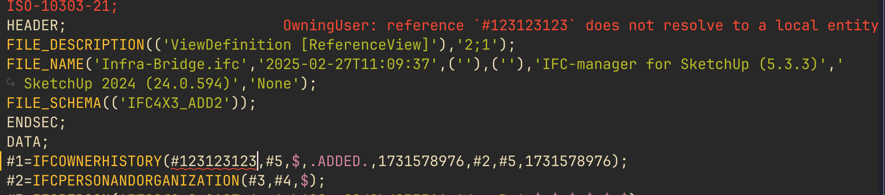
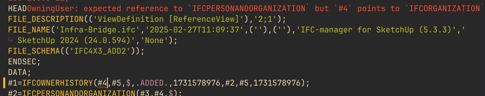
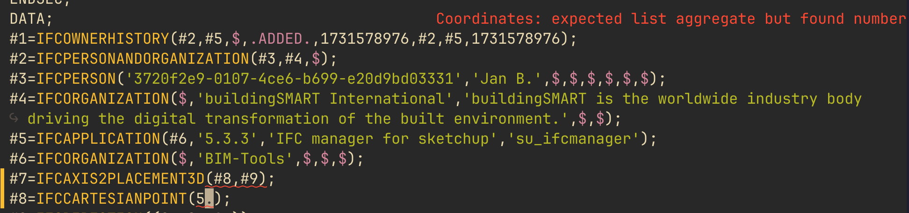
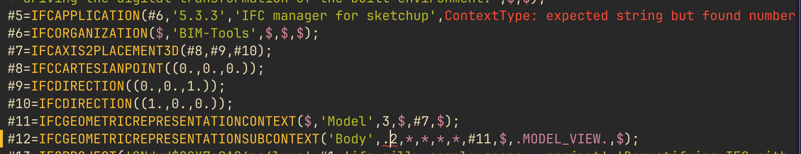
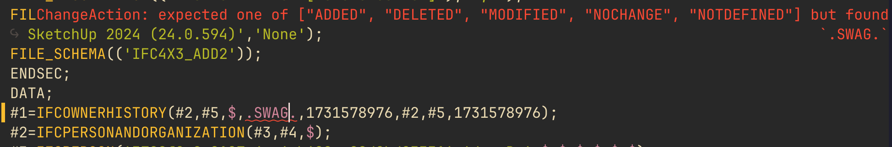
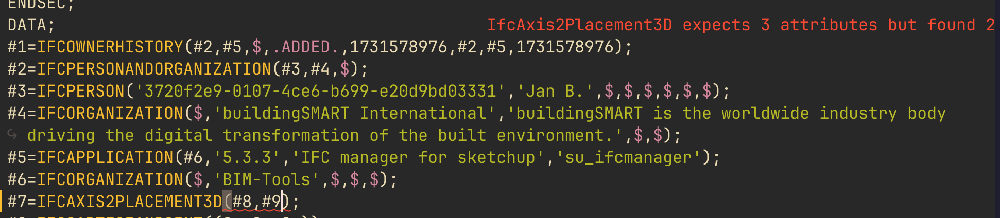
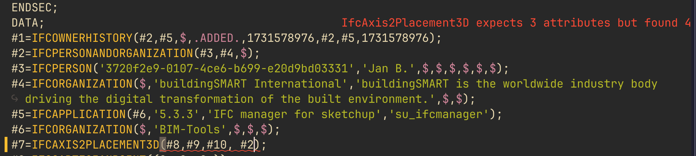
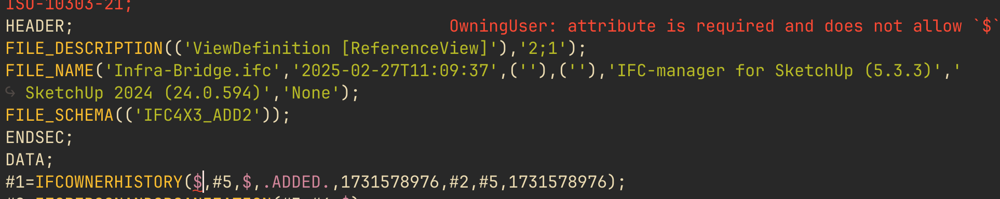
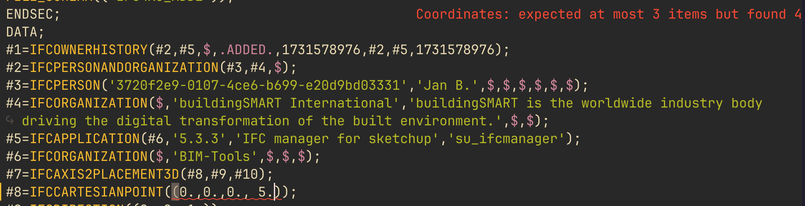

# Current Diagnostics Capabilities

This document summarizes what the current diagnostics provider in `ifc-language-server` can already validate for IFC STEP entity instances.

## 1. Reference Diagnostics

The diagnostics provider checks whether a reference points to an entity that is compatible with the expected schema type.

What is detected:

unresolved local references such as `#9999` when that entity does not exist in the current file

references to the wrong entity kind

## 2. Datatype Diagnostics

The diagnostics provider checks primitive datatype mismatches for attribute values.

## 3. Enum Diagnostics

The diagnostics provider validates EXPRESS enumerations.

What is detected:

- invalid enum literal for a given attribute
- correct enum syntax but value not part of the allowed set
- wrong value kind where an enum is expected

## 4. Attribute Count Diagnostics

The diagnostics provider checks the number of supplied arguments against the resolved schema definition of the entity, including inherited attributes.

What is detected:

too few attributes

too many attributes

## 5. Required Attribute Omission Diagnostics

The diagnostics provider checks whether required attributes are omitted with `$`.

## 6. Omitted `*` Handling

The diagnostics provider distinguishes between valid and invalid uses of `*`.

## 7. List Cardinalities

Checks if the cardinalities for an agggregation type are correct.

## Current Limitations

The current diagnostics provider does not yet implement:

- evaluation of EXPRESS `WHERE` rules
- cross-file reference validation
- semantic checks beyond the currently modeled argument/type validation
- suggestions or quick fixes
